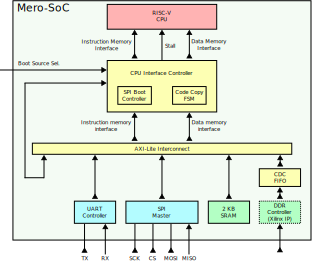

# Mero-SoC
**Simple SoC with a 32‑bit RISC‑V core and basic peripherals**

  

Features:
- 5 pipeline stages RISC-V processor supporting the full RV32I ISA
- UART interface
- SPI master interface
- 2 KB of integrated SRAM
- Multiple booting options
  - From external SPI flash
  - From internal RAM (if previously initialized)
  - From external DDR (using Xilinx DDR controller)
- Parametric AXI-Lite interconnect for easy expansion of master/slaves

The SoC has been implemented on a Spartan-7 Xilinx FPGA and in ASIC [SKY130](https://github.com/google/skywater-pdk) technology using the [openlane2](https://github.com/efabless/openlane2) flow.

## Usage
**Prerequisites**
- [RISC-V toolchain](https://github.com/riscv-collab/riscv-gnu-toolchain/tree/master) to compile software
- [Icarus Verilog](https://github.com/steveicarus/iverilog) or QuestaSim to simulate the hardware
- [GTKWave](https://github.com/gtkwave/gtkwave) to visualize Icarus simulations results
- [Ripes](https://github.com/mortbopet/Ripes) simulator to validate the correct software execution

Install the software and add the folders with the executables to the `PATH` environment variable.

**Get the sources**

    git clone https://github.com/marcomassetti/mero-soc

**Run one of the example programs in the sim directory**

    cd ./src/sim/fibonacci
    make batch_ref

The simulation flow will:
- Check that the prerequisites are met
- Create an `obj` directory under the top directory of the project, where all the auto-generated files will be stored
- Compile all the design and testbench files (choosing between Icarus Verilog and QuestaSim can be done with the `SIMULATOR` variable in `base.mk` makefile)
- Compile the C program
- Execute the program using Ripes
- Run the hardware simulation
- Compare the register file content after the Ripes and hardware simulations

The two simulations will stop automatically when the `ecall` instruction is executed at the end of the program.

By default, the code is compiled to use only the internal SRAM as code and data memory. Two others linker scripts are provided under `src/firmware/` to boot from external flash and use SRAM/DRAM as data memories. The desired linker script can be selected editing the makefile `base.mk`.

**Other supported commands**   
Other `make` targets are available under src/sim/<any_test> directory:
- `make clean`: Clean the entire object directory
- `make analyze`: Compile the design/testbench
- `make batch_ref`: Run Ripes and hardware simulations, then compare the register-files content
- `make batch`: Run the simulation without opening the gui. Do not run Ripes
- `make gui`: Run simulation opening the gui and logging all the signals. Do not run Ripes
- `make golden`: Generate the output of the Ripes simulation
- `make dump`: Print assembly of the executable file

## Hardware modules
### Processor

  

Five pipeline stages Harvard architecture RISC-V processor supporting the full RV32I ISA.
This processor is a revisited version of the [RISC-V-lite](https://github.com/Pietro4F/RISC-V-lite) CPU that has been realized as part of the *Integrated Systems Architecture* course. Support for missing RV32I has been added, various bugs have been solved and RTL description has been simplified.

  

| Characteristic                     | Value |
| ---------------------------------- | ----- |
| ASIC $` f_{max} `$   (SKY130 @nom_tt_025C_1v80) | 107 MHz |
| ASIC Utilization                   | Combinational logic cells: 9907  Flip-Flops: 1469  Area: $` 0.19 mm^2 `$ |
| FPGA $` f_{max} `$   (XC7S25-CSGA324)           | 110 MHz |
| FPGA Utilization (XC7S25-CSGA324)  | LUTs: 1151  Flip-Flops: 1506 |

The IOs of the processors are: clock, reset, instruction and data memory interfaces, cpu stall input, trap output signal.  
The `trap_o` signal is asserted with the `ecall` and `ebreak` instructions, and it is used to detect when to stop the simulation.

The processor expects both memories to perform read/write operations in a single clock cycle. To allow for higher memory latency, the processor can be stalled driving the `mem_ready_i` signal low until the request of both memory interfaces are completed.  
It this SoC the memory access is managed by a dedicated block, it stalls the CPU while waiting for memory transactions to complete and allows the use of a single memory for both instructions and data.

### CPU interface controller

  

**Register Space**
| Offset | Register Name    | Default Value | Description |
| ------ | ---------------- | ------------- | -------------|
| 0x0    | Control Register | 0             | Bit_31-Bit_2: Reserved  Bit_1: Select destination of copy (0:SRAM; 1:DDR)  Bit_0: start copy from code memory to data memory (cleared automatically at the end of the copy) |
| 0x4    | Status Register  | Depends on strapping | Bit_31-Bit_3: Reserved  Bit_1-Bit_2: Boot source (0:SPI flash; 1:SRAM; 2:DDR)  Bit_0: Processor is executing from the copy |
| 0x8    | Start address    | 0             | Bit_31-Bit_0: Address from where to start copying (must not include BUS offset) |
| 0xC    | Stop address     | 0             | Bit_31-Bit_0: Address where to stop copying (must not include BUS offset) |

**Instruction memory access**   
This block connects the CPU memory interfaces to the main AXI-Lite BUS, and allows to booting from different sources.  
When the processor starts a new instruction memory access, the request is forwarded to the correct boot memory (selected via the `boot_source_i` input), depending on the selected memory, there are two possible access procedures:
- The memory is directly accessible (internal SRAM and external DDR): the BUS offset where the memory is mapped is added to the address, then the CPU request is translated into an AXI transaction and connected to the BUS
- The memory is accessed via an intermediate controller (external SPI flash): the request is passed though a `SPI boot controller`, it translates the CPU request into the multiple BUS accesses required to control the SPI peripheral and read back the data (send FLASH read command, send 24bit address, send 4 dummy bytes, read 4 bytes reply)

In both cases the CPU is stalled until the data is read.

**Data memory access**   
If both an instruction and data memory access are started, an FSM forwards the accesses and waits for both of them to complete. When one operations concludes, the data that has been read is stored and the CPU is kept stalled until also the second operation finishes.  
If both accesses are directed towards the same memory, the arbitration is not performed by this block, the interconnect is expected to perform it to avoid conflicts.  

**Copy from SPI flash**   
Since executing from SPI would be slow, it is possible to copy the executable code from flash to RAM, then resume the execution from RAM.  
The copy can be performed by a FSM configurable by the CPU, it is possible to program the addresses where to start/stop copying, and the destination memory where to copy (source memory is always SPI flash). The copy can then be started writing a '1' into Bit_0 of the control register.  
During the copy process the CPU is stalled, it will then be automatically released after completion of the copy process and it will continue executing from the memory used as copy destination. 
After the first copy, Bit_0 of the status register will be asserted. New copies can be started following the same procedure as the first one.

### AXI Interconnect
**Memory Map**
| Address                     | Peripheral |
| ----------------------------| ---------- |
| 0x00000000 - 0x000007FF     | Internal SRAM |
| 0x00010000 - 0x0001000C     | CPU interface controller |
| 0x00010100 - 0x00010114     | UART Controller |
| 0x00010200 - 0x0001021C     | SPI Master |
| 0xF0000000 - 0xFFFFFFFF     | DDR Controller |

An AXI-Lite interconnect is used to connect all the devices. In this SoC there are two master interfaces (CPU instruction and CPU data) and five slave interfaces.  
The number of interfaces and address mapping of the interfaces is parametric to facilitate the connection of new modules to the BUS.  
Arbitration is performed assigning an higher priority to the masters connected to the interfaces with lower indexes.  
Clock-domain-crossings are not implemented inside the interconnect, a CDC FIFO can be placed outside the interconnect (as it is done for the DDR controller in this SoC).

### UART Controller
**Register Space**
| Offset  | Register Name     | Default Value | Description |
| ------- | ----------------- | --------------| ----------- |
| 0x00    | RX FIFO Data      | 0             | Bit_7-Bit_0: Received data |
| 0x04    | TX FIFO Data      | 0             | Bit_7-Bit_0: Data to be transmitted |
| 0x08    | Status Register   | 5             | Bit_7: Reserved  Bit_6: RX frame error: Set if received stop bit is 0 (cleared by reading this register)  Bit_5: Overrun error: Set if received byte while RX fifo is full (cleared by reading this register)  Bit_4: Reserved  Bit_3: TX fifo full  Bit_2: TX fifo empty  Bit_1: RX fifo full  Bit_0: RX fifo not empty |
| 0x0C    | Control Register  | 0             | Bit_7-Bit_2: Reserved  Bit_1: RX fifo reset (bit automatically cleared)  Bit_0: TX fifo reset (bit automatically cleared) |
| 0x10    | Clock divider LSB | 8             | Bit_7-Bit_0: Lower byte of the clock divider (minimum value is 8) |
| 0x14    | Clock divider MSB | 0             | Bit_7-Bit_0: Higher byte of the clock divider (minimum value is 0) |

UART controller with configurable baud rate and TX/RX FIFOs with parametric depth (16 byte by default). It operates 8bit frames only with and no parity bit.

$` BaudRate = \frac{f_{clk}}{ClkDiv} `$

The RX line is oversampled at 8x the baud rate to improve reliability. The value of each bit is obtained observing three samples at the center of each bit-time to reduce the probability of errors due to noise.  
Metastability is prevented by using a two Flip-Flop synchronizer.  
Data starts to be transmitted as soon as it is placed in the TX fifo.

### SPI Master
**Register Space**
| Offset  | Register Name     | Default Value | Description |
| ------- | ----------------- | ------------- | ----------- |
| 0x00    | Control Register  | 0             | Bit_7-Bit_6: Reserved  Bit_5: Enable LSB first operation  Bit_4: Set clock phase  Bit_3: Set clock polarity  Bit_2: TX inhibit, pause transmission when asserted  Bit_1: RX fifo reset(bit automatically cleared)  Bit_0: TX fifo reset(bit automatically cleared) |
| 0x04    | Status Register   | 5             | Bit_7-Bit_4: Reserved  Bit_3: TX fifo full  Bit_2: TX fifo empty  Bit_1: RX fifo full  Bit_0: RX fifo empty |
| 0x08    | TX FIFO Data      | 0             | Bit_7-Bit_0: Data to be transmitted |
| 0x0C    | RX FIFO Data      | 0             | Bit_7-Bit_0: Received data |
| 0x10    | TX FIFO Level     | 0             | Bit_7-Bit_0: Number of bytes in the TX fifo |
| 0x14    | RX FIFO Level     | 0             | Bit_7-Bit_0: Number of bytes in the RX fifo |
| 0x18    | Clock divider LSB | 1             | Bit_7-Bit_0: Lower byte of the clock divider (minimum value is 1) |
| 0x1C    | Clock divider MSB | 0             | Bit_7-Bit_0: Higher byte of the clock divider (minimum value is 0) |

SPI master with configurable clock frequency/polarity/phase and configurable bit order, allowing operation in all modes. TX/RX fifo depths are parametric (16 byte by default) 

$` f_{sck} = \frac{f_{clk}}{2 \cdot ClkDiv} `$

Since data transmission can be as fast as half the system clock frequency, it is possible to stop the data transmission asserting the inhibit bit. This will allow to fill the TX FIFO with all the necessary data and the transmission can then be started releasing the inhibit.

## FPGA implementation

  

The complete system has been deployed on a Digilent Arty S7 developent board. The board is equipped with a Spartan-7 (XC7S25-CSGA324) Xilinx FPGA, and it includes a 16 MB QSPI FLASH, and 256 MB of DDR3L DRAM.  
Both memories can be accessed by the processor, but, since currently a DDR controller has not been developed, to use the DRAM a controller needs to be generated using the Memory-Interface-Generator included with Vivado. Since it is possible to use the system without using the DDR, the controller logic is included in the implementation only if the `DDR` verilog define is enabled. The `FPGA` define must always be enabled while synthesizing for FPGA.

The system has been synthesized both with and without the DDR controller, area difference. In both cases the operating frequency is limited by the CPU (110 MHz).

The IOs have been exposed on FPGA pads to use the resources available on the board:
 - Reset signal: connected to a button
 - Clock signal: connected to 100 MHz oscillator
 - Boot Source selector: connected to switches, to select the code memory from where the CPU should execute code
 - UART controller: connected to a USB-to-UART converter to allow serial communication to a PC via USB connection
 - SPI master: connected to QSPI FLASH (memory is also used to store the FPGA configuration)
 - DDR controller: connected to DDR3L DRAM

Tcl scripts and IP properties files to perform FPGA implementations are provided under the `vivado` folder.

| Characteristic                       | Value |
| ------------------------------------ | ----- |
| Utilization (without DDR controller) | LUTs: 2646  Flip-Flops: 2870 |
| Utilization (with DDR controller)    | LUTs: 8075  Flip-Flops: 8054 |

## ASIC implementation

  

The system has also been implemented in the SKY130 technology using the openlane2 flow.  
The 2KB SRAM has been generated using the [OpenRAM](https://github.com/VLSIDA/OpenRAM) framework. The source file for the memory generation can be found under `src/design/ram_macro`.  
Since the DDR controller is a Xilinx specific IP, it has been excluded from the synthesis.

As for the fpga implementation, the scripts to run the flow are provided under the `openlane2` folder.

| Characteristic                     | Value |
| ---------------------------------- | ----- |
| Combinational logic cells          | 16471 |
| Flip-Flops                         | 2918  |
| Area                               | 0.487 $` mm^2 `$ |
